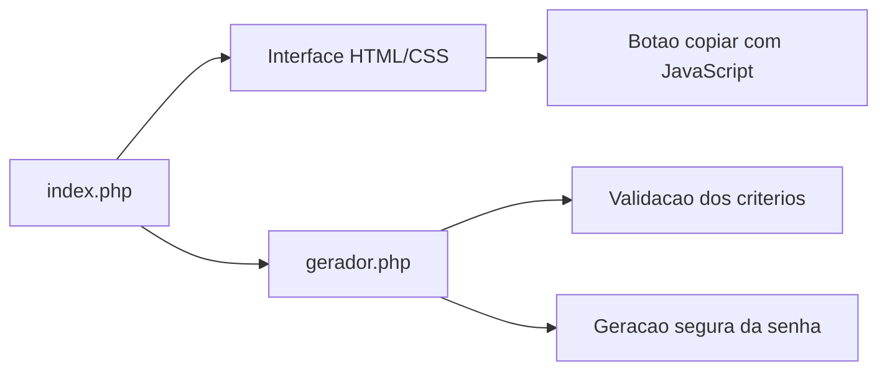

# Gerador de Senhas Seguras

Aplicacao web simples em PHP para gerar senhas aleatorias e seguras com base nos criterios definidos pelo usuario.

## Recursos

- Definicao do tamanho da senha.
- Inclusao opcional de letras maiusculas.
- Inclusao opcional de letras minusculas.
- Inclusao opcional de numeros.
- Inclusao opcional de caracteres especiais.
- Validacao dos criterios informados.
- Geracao segura usando `random_int()`.
- Botao para copiar a senha gerada.

## Tecnologias

- OpenAI Codex como assistente de IA no desenvolvimento
- PHP
- HTML
- CSS
- JavaScript
- XAMPP para execucao local

## Como executar

1. Coloque o projeto dentro da pasta `htdocs` do XAMPP.
2. Inicie o Apache pelo painel do XAMPP.
3. Acesse no navegador:

```text
http://localhost/projeto/projeto_akcit/
```

## Como testar

Execute os arquivos de teste pela raiz do projeto:

```powershell
C:\xampp\php\php.exe tests\test_conf.php
C:\xampp\php\php.exe tests\test_gerador.php
```

## Arquitetura



## Fluxo da aplicacao


[Abrir imagem do fluxo](docs/fluxo-aplicacao.svg)

## Estrutura atual

```text
PROJETO/
|-- README.md
|-- docs/
|   `-- fluxo-aplicacao.svg
|-- projeto_akcit/
|   |-- gerador.php
|   `-- index.php
|-- tests/
|   |-- test_conf.php
|   `-- test_gerador.php
|-- .gitignore
`-- requeriments.txt
```

## Regras de validacao

- O tamanho da senha deve estar entre 4 e 128 caracteres.
- Pelo menos um tipo de caractere deve ser selecionado.
- O tamanho da senha deve ser maior ou igual a quantidade de tipos de caracteres selecionados.

## Observacoes de seguranca

A geracao da senha usa `random_int()`, uma funcao adequada para valores aleatorios seguros em PHP. A senha gerada garante pelo menos um caractere de cada tipo selecionado pelo usuario.
